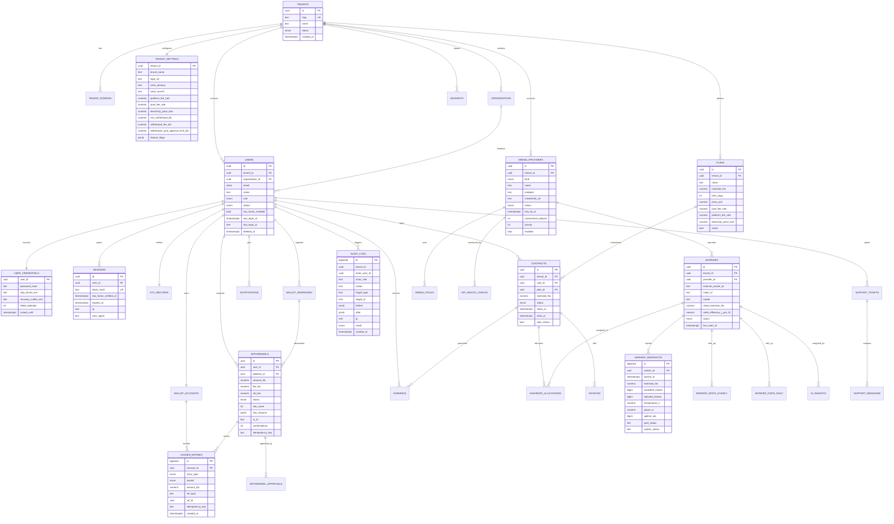

# ER図



## 残高の考え方（重要）

`WALLET_ACCOUNTS` は残高カラムを持たない。残高は必ず `LEDGER_ENTRIES` の合計で導出する。

```
available = SUM(amount_btc) WHERE account_id = ? AND bucket = 'AVAILABLE'
locked    = SUM(amount_btc) WHERE account_id = ? AND bucket = 'LOCKED'
```

出金申請時は2行を同一トランザクションで書く（合計はゼロ＝資産が増減しない）:

| entry_type | bucket | amount |
|---|---|---|
| `WITHDRAWAL_LOCK` | `AVAILABLE` | `-0.01` |
| `WITHDRAWAL_LOCK` | `LOCKED` | `+0.01` |

却下時は逆仕訳（`WITHDRAWAL_REVERSE`）、送金完了時は `LOCKED` から `-0.01`（`WITHDRAWAL_SETTLE`）。
この方式なら「残高が消える」バグが構造的に起きない。
